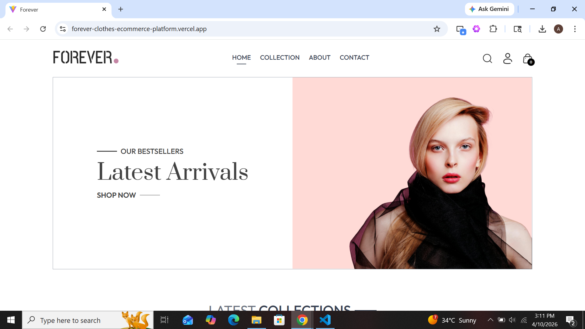
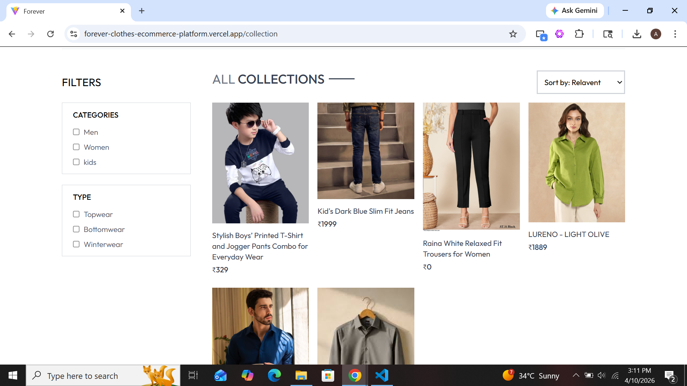
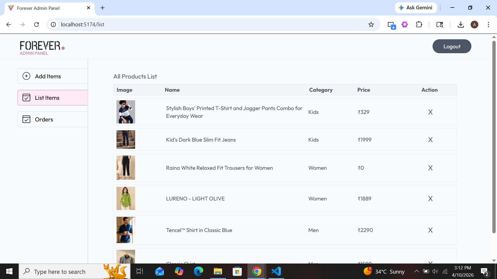

#  Forever — Full Stack E-Commerce Platform

<div align="center">


[](https://reactjs.org/)
[](https://nodejs.org/)
[](https://mongodb.com/)
[](https://cloudinary.com/)
[](https://stripe.com/)
[](https://razorpay.com/)
[](https://tailwindcss.com/)

**A production-ready, feature-rich e-commerce web application with a customer storefront, secure REST API backend, and a dedicated admin panel — all built from scratch.**

[Live Demo](#) · [Report Bug](#) · [Request Feature](#)

</div>

---

## 📸 Screenshots

| Storefront | Product Page | Admin Panel |
|---|---|---|
|  |  |  |

---

## ✨ Key Features

### 🧑‍💻 Customer Storefront
- 🏠 Dynamic homepage with **Hero Banner**, **Latest Collection**, and **Best Sellers**
- 🔍 **Search & Filter** products by category, sub-category, and price
- 🛒 **Persistent Cart** with real-time quantity updates
- 📦 **Order Tracking** — view live order status from your account
- 🔐 **JWT-based Authentication** — secure login & registration
- 📱 Fully **Responsive Design** for mobile, tablet, and desktop

### 🛠️ Admin Panel
- ➕ **Add / Remove Products** with multi-image upload (via Cloudinary)
- 📋 **View & Manage All Orders** in one dashboard
- 🔄 **Update Order Status** (Order Placed → Packing → Shipped → Delivered)
- 🔒 Protected with admin-only JWT middleware

### 💳 Payment Integration
- **Stripe** — International card payments
- **Razorpay** — Indian payment gateway (UPI, Cards, Netbanking)
- **Cash on Delivery** — No payment gateway needed

---

## 🏗️ Architecture Overview

```
forever/
├── backend/        # Node.js + Express REST API
│   ├── config/     # MongoDB & Cloudinary setup
│   ├── controllers/# Business logic (user, product, cart, order)
│   ├── middleware/ # JWT Auth & Multer file upload
│   ├── models/     # Mongoose schemas
│   ├── routes/     # API route definitions
│   └── server.js   # Entry point
│
├── frontend/       # React.js Customer Storefront
│   └── src/
│       ├── components/  # Reusable UI components
│       ├── context/     # Global state (Cart, Auth)
│       └── pages/       # Route-level page components
│
└── admin/          # React.js Admin Dashboard
    └── src/
        ├── components/
        └── pages/
```

---

## 🧰 Tech Stack

| Layer | Technology |
|---|---|
| **Frontend** | React 18, React Router v6, Tailwind CSS, Axios |
| **Backend** | Node.js, Express.js, JWT, Bcrypt, Multer |
| **Database** | MongoDB Atlas (Mongoose ODM) |
| **Media Storage** | Cloudinary |
| **Payments** | Stripe, Razorpay |
| **Dev Tools** | Vite, Nodemon, ESLint |
| **Deployment** | Vercel (Frontend + Admin), Render/Railway (Backend) |

---

## 🚀 Getting Started

### Prerequisites
- [Node.js](https://nodejs.org/) v18+
- [MongoDB Atlas](https://www.mongodb.com/cloud/atlas) account (free tier works)
- [Cloudinary](https://cloudinary.com/) account (free tier works)

### 1. Clone the Repository

```bash
git clone https://github.com/your-username/forever-ecommerce.git
cd forever-ecommerce
```

### 2. Setup Backend

```bash
cd backend
npm install
```

Create a `.env` file inside `/backend`:

```env
JWT_SECRET = "your_jwt_secret"
ADMIN_EMAIL = "admin@example.com"
ADMIN_PASSWORD = "your_admin_password"

MONGODB_URI = "your_mongodb_connection_string"

CLOUDINARY_NAME = "your_cloud_name"
CLOUDINARY_API_KEY = "your_api_key"
CLOUDINARY_SECRET_KEY = "your_api_secret"

STRIPE_SECRET_KEY = "your_stripe_secret_key"

RAZORPAY_KEY_ID = "your_razorpay_key_id"
RAZORPAY_KEY_SECRET = "your_razorpay_secret"
```

Start the backend server:
```bash
npm run server
```
> Backend runs at `http://localhost:4000`

### 3. Setup Frontend

```bash
cd ../frontend
npm install
npm run dev
```
> Storefront runs at `http://localhost:5173`

### 4. Setup Admin Panel

```bash
cd ../admin
npm install
npm run dev
```
> Admin panel runs at `http://localhost:5174`

> ⚠️ **Important:** Always start the backend first before running frontend or admin.

---

## 🔌 API Endpoints

### Auth
| Method | Endpoint | Description |
|--------|----------|-------------|
| POST | `/api/user/register` | Register new user |
| POST | `/api/user/login` | User login |
| POST | `/api/user/admin` | Admin login |

### Products
| Method | Endpoint | Description |
|--------|----------|-------------|
| GET | `/api/product/list` | Get all products |
| GET | `/api/product/single` | Get single product |
| POST | `/api/product/add` | Add product *(Admin)* |
| DELETE | `/api/product/remove` | Remove product *(Admin)* |

### Cart
| Method | Endpoint | Description |
|--------|----------|-------------|
| POST | `/api/cart/add` | Add item to cart |
| POST | `/api/cart/update` | Update cart item |
| POST | `/api/cart/get` | Get user cart |

### Orders
| Method | Endpoint | Description |
|--------|----------|-------------|
| POST | `/api/order/place` | Place order (COD) |
| POST | `/api/order/stripe` | Place order via Stripe |
| POST | `/api/order/razorpay` | Place order via Razorpay |
| POST | `/api/order/userorders` | Get user orders |
| POST | `/api/order/list` | Get all orders *(Admin)* |
| POST | `/api/order/status` | Update order status *(Admin)* |

---

## 🌍 Deployment

This project is configured for deployment on **Vercel** (Frontend & Admin) and **Render** (Backend).

A `vercel.json` is already included in the backend for seamless serverless deployment.

**Steps:**
1. Push each folder (`backend`, `frontend`, `admin`) as separate Vercel/Render projects
2. Set all environment variables in the hosting dashboard
3. Update the backend URL in frontend/admin `.env` files

---

## 🤝 Contributing

Contributions are welcome! Feel free to open issues or submit pull requests.

1. Fork the project
2. Create your feature branch (`git checkout -b feature/AmazingFeature`)
3. Commit your changes (`git commit -m 'Add some AmazingFeature'`)
4. Push to the branch (`git push origin feature/AmazingFeature`)
5. Open a Pull Request

---

## 📄 License

Distributed under the MIT License. See `LICENSE` for more information.

---

## 👤 Author

**Your Name**
- GitHub: [@your-username](https://github.com/your-username)
- LinkedIn: [your-linkedin](https://linkedin.com/in/your-profile)
- Portfolio: [your-portfolio.com](#)

---

<div align="center">

⭐ **If you found this project helpful, please give it a star!** ⭐

Made with ❤️ using the MERN Stack

</div>
